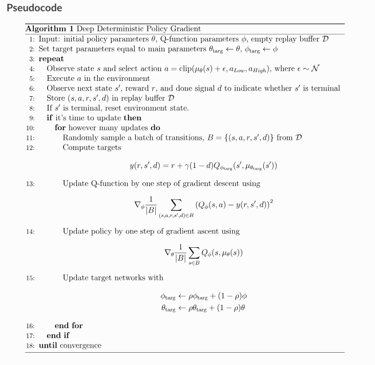
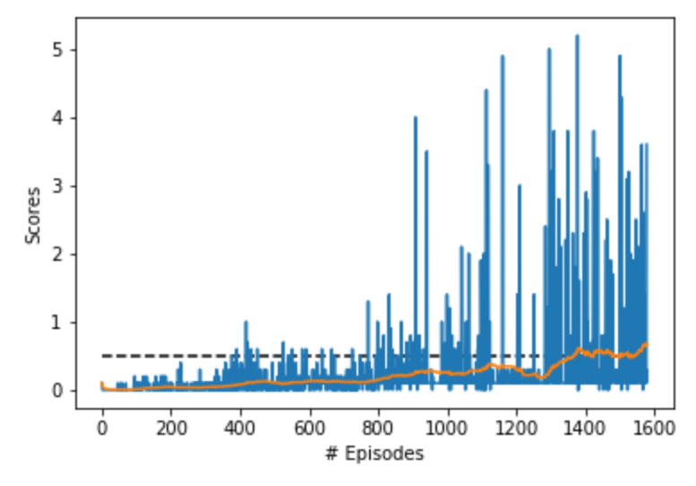

# Report Project 3: Multi-Agent Collaboration & Competition
##### &nbsp;

## Goal
The goal of this project is to train two RL agents to play tennis. As in real tennis, the goal of each player is to keep the ball in play. And, when you have two equally matched opponents, you tend to see fairly long exchanges where the players hit the ball back and forth over the net.

##### &nbsp;

## Learning Algorithm
### Multi-Agent Deep Deterministic Policy Gradient (MADDPG)
I created Multi-Agent version of DDPG. DDPG is an algorithm which concurrently learns a Q-function and a policy. It uses off-policy data and the Bellman equation to learn the Q-function, and uses the Q-function to learn the policy.

+ DDPG is an off-policy algorithm.
+ DDPG can only be used for environments with continuous action spaces.
+ DDPG can be thought of as being deep Q-learning for continuous action spaces.
+ DDPG can be implemented with parallelization

DDPG is closely connected to Q-learning algorithms, and it concurrently learns a Q-function and a policy which are updated to improve each other.

Algorithms like DDPG and Q-Learning are off-policy, so they are able to reuse old data very efficiently. They gain this benefit by exploiting Bellman’s equations for optimality, which a Q-function can be trained to satisfy using any environment interaction data (as long as there’s enough experience from the high-reward areas in the environment).

### DDPG Pseudocode

(Reference: https://spinningup.openai.com/en/latest/algorithms/ddpg.html#the-policy-learning-side-of-ddpg)

### Hyper Parameters
#### MADDPG Parameters
+ BUFFER_SIZE = int(1e6)        # replay buffer size
+ BATCH_SIZE = 128              # minibatch size
+ LR_ACTOR = 1e-3               # learning rate of the actor
+ LR_CRITIC = 1e-3              # learning rate of the critic
+ WEIGHT_DECAY = 0              # wei# final value for epsilon after decayght decay
+ LEARN_EVERY = 1               # learning interval (no. of episodes)
+ LEARN_NUM = 5                 # number of passes per learning step
+ GAMMA = 0.99                  # discount factor
+ TAU = 8e-3                    # for soft update of target parameters

#### Noise parameters
+ OU_SIGMA = 0.2                # Ornstein-Uhlenbeck noise parameter, volatility
+ OU_THETA = 0.15               # Ornstein-Uhlenbeck noise parameter, speed of mean reversion
+ EPS_START = 5.0               # initial value for epsilon in noise decay process in Agent.act()
+ EPS_EP_END = 300              # episode to end the noise decay process
+ EPS_FINAL = 0                 # final value for epsilon after decay

#### Neural Network Model Architecture & Parameters
For this project we use these models:

~~~~
Actor Model:
    (fc1): Linear(in_features=48, out_features=256, bias=True)
    (fc2): Linear(in_features=256, out_features=128, bias=True)
    (fc3): Linear(in_features=128, out_features=2, bias=True)

Critic Model:
    (fcs1): Linear(in_features=48, out_features=256, bias=True)
    (fc2): Linear(in_features=260, out_features=128, bias=True)
    (fc3): Linear(in_features=128, out_features=1, bias=True)
~~~~

##### &nbsp;

## Results
Once all of the above components were in place, the agents were able to solve the Tennis environment. Again, the performance goal is an average reward of at least +0.5 over 100 episodes, taking the best score from either agent for a given episode.

The graph below shows the final training results. The best-performing agents were able to solve the environment in 1269 episodes. 

##### &nbsp;

## Idears for Future Work
- **Address stability issues to produce more consistent results** &mdash; My "best" results are only reproducible if you run the model numerous times. If you just run it once (or even 3-5 times) the model might not converge. I ran the model at least 30 while searching for a good set of hyperparameters, so perhaps implementing a more systemic approach such as grid search would help. Otherwise, more research is needed to find a more stable algorithm, or to make changes to the current DDPG algorithm.
- **Add prioritized experience replay** &mdash; Rather than selecting experience tuples randomly, prioritized replay selects experiences based on a priority value that is correlated with the magnitude of error. This can improve learning by increasing the probability that rare or important experience vectors are sampled.
